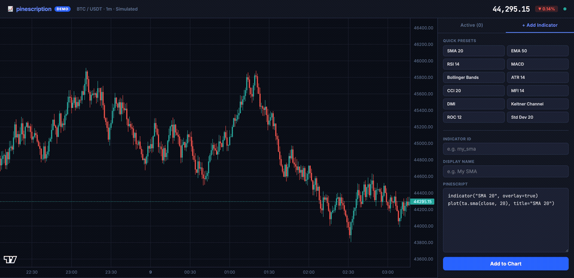

<!--
SPDX-FileCopyrightText: 2026 Woodstock K.K.

SPDX-License-Identifier: AGPL-3.0-only
-->

<p align="center"></p>

<h1 align="center">Pinescription</h1>

<p align="center">A high-performance Pine Script v6 compiler and runtime for Go.</p>

<p align="center">Pinescription compiles Pine Script code into optimized bytecode and executes it against market data providers, enabling you to run TradingView indicators and strategies in production Go applications without webhooks or external dependencies.</p>

---

<p align="center">
  <a href="https://go.dev"></a>
  <a href=".github/workflows/pr-main.yml"></a>
  <a href="#license"></a>
  <a href="https://pkg.go.dev/github.com/woodstock-tokyo/pinescription"></a>
</p>

---

<p align="center">
  
</p>

---

## Why Pinescription

- **No webhooks, no lock-in.** Run Pine Script indicators directly in your Go backend. Connect to any broker API through a simple provider interface.
- **Native Go performance.** The compiler generates optimized bytecode with streaming evaluation. Benchmarks show 164x speedup over full recomputation.
- **Pine Script v6 compatible.** Supports language core, arrays, matrices, tuples, 30+ indicators, and the `ta.*` namespace.
- **Single dependency.** Built on gonum for linear algebra. No other external dependencies.

## Quick Start

**Step 1: Install**

```bash
go get github.com/woodstock-tokyo/pinescription
```

**Step 2: Write your first indicator**

```go
package main

import (
    "fmt"
    pinego "github.com/woodstock-tokyo/pinescription"
)

func main() {
    engine := pinego.NewEngine()
    engine.RegisterMarketDataProvider(&yourProvider{})
    engine.SetDefaultSymbol("AAPL")

    script := `
var ma = sma(close, 20)
var ex = ema(close, 20)
ma + ex
`

    bytecode, err := engine.Compile(script)
    if err != nil {
        panic(err)
    }
    result, err := engine.Execute(bytecode)
    if err != nil {
        panic(err)
    }
    fmt.Println("Result:", result)
}
```

**Step 3: Explore more examples**

See `examples/basic/main.go` for a working demo with sample market data, or `examples/volume_profile_pivot_anchored/` for a complex Pine Script v6 execution.

---

## Performance

Benchmarked on Apple M3:

| Benchmark | Result | Notes |
|-----------|--------|-------|
| Bollinger Bands (streaming) | 634 ns/op | 164x faster than full recompute |
| 5000-bar indicators | ~5.8 ms/op | Optimized sliding window |
| Fisher Transform (5000 bars) | ~10.9 ms/op | Complex multi-step indicator |

The streaming execution model updates only the active bar state, avoiding full recalculation on each iteration.

---

## Features

- **Language Core**: `var`/`const` declarations, `if`/`else`/`for`/`while`/`switch`, functions, arrays, tuples, matrices
- **30+ Built-in Indicators**: SMA, EMA, RSI, ATR, Bollinger Bands, crossover, crossunder, stdev, correlation...
- **Full `ta.*` Namespace**: `ta.sma`, `ta.ema`, `ta.rsi`, `ta.atr`, `ta.bb`...
- **`math.*` Namespace**: `math.abs`, `math.pow`, `math.sqrt`, `math.log`, `math.sin`...
- **Array Operations**: 25+ methods including `push`, `pop`, `sort`, `sum`, `avg`...
- **Matrix Operations**: Linear algebra helpers, eigenvalues, determinant, transpose...
- **String Operations**: `str.format`, `str.split`, `str.replace`, `str.contains`...
- **Market Data**: Multi-symbol queries (`close_of`, `sma_of`...), history indexing (`close[1]`)
- **Alerts**: `alert()` and `alertcondition()` with custom sinks

See [docs/features.md](docs/features.md) for the complete feature reference.

---

## Documentation

| Document | Description |
|----------|-------------|
| [API Reference](docs/api.md) | Complete API surface: Engine, Runtime, Provider, Alerts |
| [Architecture and Design](docs/architecture.md) | Compilation pipeline, execution flow, streaming evaluation model |
| [Feature Reference](docs/features.md) | Exhaustive list of supported Pine Script v6 features |

---

## Architecture

Pinescription compiles Pine Script source to intermediate representation, then encodes it as bytecode. At runtime, the VM evaluates the bytecode bar-by-bar against market data from your provider. See [docs/architecture.md](docs/architecture.md) for detailed flow diagrams.

---

## Provider Interface

Your market data provider implements the `Provider` interface:

```go
type Provider interface {
    GetSeries(seriesKey string) (SeriesExtended, error)  // seriesKey = "symbol|value_type"
    GetSymbols() ([]string, error)
    GetValuesTypes() ([]string, error)
    SetTimeframe(timeframe string) error
    GetTimeframe() string
    SetSession(session string) error
    GetSession() string
}
```

Common series keys include `AAPL|close`, `AAPL|volume`, etc.

---

## Unsupported in Open Source Version - Need Custom Function Hooks

- Strategy APIs (`strategy.entry`, `strategy.exit`...)
- Plot APIs (`plot`, `plotshape`...)

These return explicit runtime errors when used unless you register an exact-name custom function hook such as `RegisterFunction("strategy.order", fn)`.

---

## License

Pinescription is dual-licensed under **AGPL-3.0-only** and a commercial license.

- AGPL-3.0-only: See `LICENSES/AGPL-3.0-only.txt`
- Commercial: See `LICENSES/LICENSE-COMMERCIAL.md`

---

## Security

See `SECURITY.md` for vulnerability reporting.

---

## Built by

Built by [Woodstock K.K.](https://woodstock.co)

> _Pine Script™ is a trademark of TradingView. Pinescription is an independent project and is not affiliated with, endorsed by, or associated with TradingView._

<a href="https://x.com/woodstockapp"></a>
