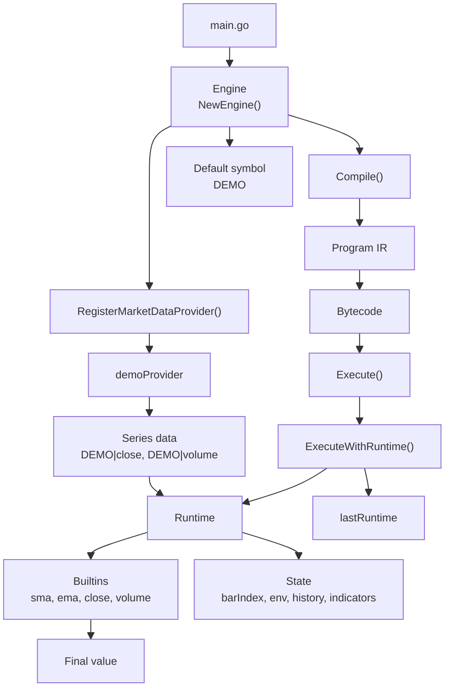
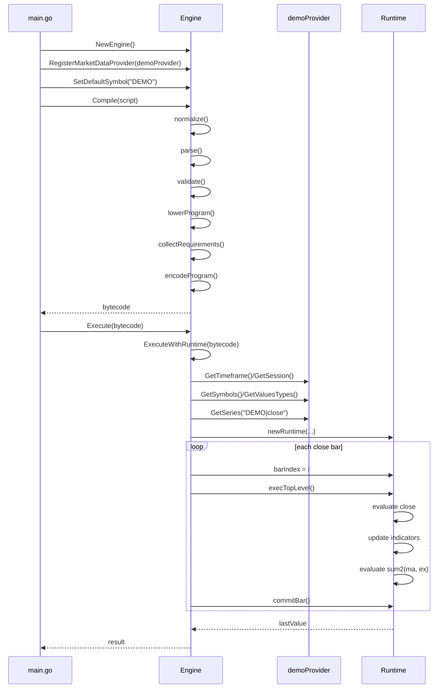

<!--
SPDX-FileCopyrightText: 2026 Woodstock K.K.

SPDX-License-Identifier: AGPL-3.0-only
-->

<p align="center">
  


<h3 align="center">No Webhooks. No Lock-in. Just Execution.</h3><br>
<p align="center">
  Bring PineScript into production-grade environments.<br>
Backtest locally, execute directly against broker APIs, and eliminate missed signals caused by webhook failures.
With no third-party MCP dependencies, your trading infrastructure stays secure and fully under your control.
</p>

<p align="center">
  <a href="#license"></a>
  <a href="https://x.com/woodstockapp"></a>
  <a href="https://woodstock.co"></a>
</p>

---

`Pinescription` is a Pine Script v6-oriented compiler/runtime in Go, released by Woodstock K.K.

It is dual-licensed under the GNU Affero General Public License v3.0 (`AGPL-3.0-only`) and a commercial license. See `LICENSES/AGPL-3.0-only.txt` and `LICENSES/LICENSE-COMMERCIAL.md`.

It compiles script text into bytecode (`[]byte`) and executes that bytecode against market series data from a provider interface.

> **About Pine Script™?**  
> [Pine Script™](https://www.tradingview.com/pine-script-docs/welcome/) is a domain-specific programming language created by TradingView for writing custom technical analysis indicators and strategies.

> _**Disclaimer** : Pinescription is an independent project and is not affiliated with, endorsed by, or associated with TradingView or Pine Script™. All trademarks and registered trademarks mentioned belong to their respective owners._

## API

There is a package-level default engine for quick usage, and the `Engine` type for isolated instances.

Package-level (default engine):

- `Compile(pinescript string) ([]byte, error)`
- `Execute(bytecode []byte) (interface{}, error)`
- `RegisterFunction(name string, function func(args ...interface{}) (interface{}, error))`
- `RegisterMarketDataProvider(provider Provider)`
- `SetTimeframe(timeframe string)`
- `SetSession(session string)`
- `SetCurrentTime(now time.Time)`
- `SetStartTime(start time.Time)`

Engine type (recommended):

- `NewEngine() *Engine`
- `(*Engine).Compile(pinescript string) ([]byte, error)`
- `(*Engine).Execute(bytecode []byte) (interface{}, error)`
- `(*Engine).ExecuteWithRuntime(bytecode []byte) (*Runtime, interface{}, error)`
- `(*Engine).RegisterFunction(name string, function func(args ...interface{}) (interface{}, error))`
- `(*Engine).RegisterMarketDataProvider(provider Provider)`
- `(*Engine).SetDefaultSymbol(symbol string)`
- `(*Engine).SetDefaultValueType(valueType string)`
- `(*Engine).SetTimeframe(timeframe string)`
- `(*Engine).SetSession(session string)`
- `(*Engine).SetAlertSink(func(AlertEvent))`
- `(*Engine).ClearRuntime()` to release retained runtime state in the engine

## Provider Resolution

- You can register multiple providers via repeated `RegisterMarketDataProvider` calls.
- `Engine.Symbols()` aggregates symbols across all registered providers.
- `Engine.ValueTypes()` aggregates supported `value_type`s across all registered providers.
- During execution, bytecode-declared symbol dependencies are resolved against that registry.
- If a symbol or `value_type` referenced by bytecode is missing from providers, execution returns an error.

## Runtime State Holder API

- `(*Engine).ExecuteWithRuntime(bytecode)` returns `(*Runtime, value, error)` for direct runtime inspection after execution.
- `Engine.Runtime()` returns the latest runtime instance (or `nil` if nothing has been executed yet).
- `Engine.ClearRuntime()` releases and clears the retained runtime.
- `Runtime.Release()` clears retained references/maps in that runtime instance.
- `Runtime.Snapshot()` returns `RuntimeSnapshot` with `BarIndex`, `LastValue`, `ActiveSymbol`, `ActiveValueType`, `Symbols`, `SeriesKeys`, and `Variables`.
- `Runtime.Symbols() []string` returns known symbols in sorted order.
- `Runtime.SeriesKeys() []string` returns loaded/known series keys in sorted order.
- `Runtime.ValueTypes(symbol string) []string` returns known value types for a symbol in sorted order.
- `Runtime.Series(seriesKey string) (SeriesExtended, bool)` returns a series and `true` when available/loadable.
- `Runtime.Value(name string) (interface{}, bool)` returns the latest value for a variable (scope/history), plus found flag.

### Engine vs Runtime

| Aspect | Engine | Runtime |
| --- | --- | --- |
| Role | Long-lived coordinator for compilation and execution | Per-execution evaluation state holder |
| Lifetime | Reusable across multiple compile/execute calls | Created for a specific execution |
| Owns | Providers, registered functions, defaults, logs, bytecode cache, retained runtime | Loaded series, active symbol/value type, bar index, variable environments, history, indicator state, last value |
| Primary APIs | `Compile`, `Execute`, `ExecuteWithRuntime`, `RegisterMarketDataProvider`, `RegisterFunction` | `Snapshot`, `Series`, `SeriesKeys`, `Symbols`, `Value`, `ValueTypes`, `Release` |
| Responsibility | Resolve providers, derive execution context, construct runtime, drive bar-by-bar evaluation | Evaluate the program, maintain history, update indicators, expose execution state |
| Retention | Keeps the latest runtime via `Engine.Runtime()` | Can be released with `Runtime.Release()` |

Use `Engine` to configure and start execution. Use `Runtime` to inspect the state produced by a completed execution.

## Alerts

`alert()` and `alertcondition()` emit events to an engine callback (there is no TradingView-style delivery). Use `(*Engine).SetAlertSink(func(AlertEvent))`.

The callback receives:

- `Message` (string)
- `Frequency` (string, optional)
- `BarIndex` (int)
- `Time` (UTC time)
- `Symbol` (string)

## Provider Interface

`Provider` must implement:

- `GetSeries(seriesKey string) (SeriesExtended, error)` where `seriesKey = symbol + "|" + value_type`
- `GetSymbols() ([]string, error)`
- `GetValuesTypes() ([]string, error)`
- `SetTimeframe(timeframe string) error`
- `GetTimeframe() string`
- `SetSession(session string) error`
- `GetSession() string`

Time/session notes:

- Engine-level `SetTimeframe(...)` / `SetSession(...)` propagate to registered providers via the provider interface setters.
- If not explicitly set on the engine, the first registered provider's `GetTimeframe()` / `GetSession()` values are used as defaults.

## Supported Features

### Language Core

- Variable declaration and assignment: `var`, `const`
- Scalar types: `int`, `float`, `bool`, `string`, `na`
- Arithmetic, logical, and comparison operators
- Ternary conditional operator: `cond ? a : b`
- Control flow: `if/else`, `for`, `while`, `switch`, `break`, `continue`, `return`
- Functions: arrow and block forms
- Composite values: arrays, tuples, and matrices

### Series And Market Data

- Built-in variables: `open`, `high`, `low`, `close`, `volume`, `hl2`, `hlc3`, `hlcc4`, `ohlc4`
- Additional built-in variables: `bar_index`
- Series history indexing on series-like values, for example `close[1]`, `x[2]`, `close_of("AAPL")[1]`
- Cross-symbol built-ins: `value_of`, `close_of`, `open_of`, `high_of`, `low_of`, `sma_of`, `ema_of`, `rsi_of`

### Indicators And Numeric Helpers

- Built-in indicators: `sma`, `ema`, `rsi`, `atr`, `bb`, `bbw`, `crossover`, `crossunder`, `change`, `highest`, `lowest`, `stdev`, `correlation`
- `ta` namespace aliases: `ta.sma`, `ta.ema`, `ta.rsi`, `ta.atr`, `ta.bb`, `ta.bbw`, `ta.crossover`, `ta.crossunder`, `ta.change`, `ta.highest`, `ta.lowest`, `ta.stdev`, `ta.correlation`
- `math` namespace subset: `math.abs`, `math.max`, `math.min`, `math.round`, `math.floor`, `math.ceil`, `math.pow`, `math.sqrt`, `math.log`, `math.exp`, `math.sin`, `math.cos`, `math.tan`
- NA helpers: `na`, `nz`
- Type helpers: `int`, `float`, `bool`, `string`

### Array Built-Ins

- Mutable arrays created via `array.new_*` (passed by reference; supports side-effect usage like `array.push(arr, x)` without assignment)
- Constructors: `array.new_*`, `array.new<type>`, `array.from`, `array.copy`
- Access and mutation: `array.size`, `array.get`, `array.set`, `array.push`, `array.pop`, `array.unshift`, `array.shift`, `array.insert`, `array.clear`, `array.concat`, `array.slice`, `array.first`, `array.last`
- Search: `array.includes`, `array.indexof`, `array.lastindexof`, `array.binary_search_leftmost`, `array.binary_search_rightmost`
- Statistics: `array.abs`, `array.sum`, `array.avg`, `array.min`, `array.max`, `array.range`, `array.median`, `array.mode`, `array.covariance`, `array.percentrank`, `array.percentile_linear_interpolation`, `array.percentile_nearest_rank`
- Utilities: `array.join`, `array.every`
- Compatibility alias: `array.percentile_neareast_rank`

### Matrix Built-Ins

- Creation, copy, and access: `matrix.new_*`, `matrix.copy`, `matrix.get`, `matrix.set`, `matrix.row`, `matrix.col`
- Shape and mutation: `matrix.rows`, `matrix.columns`, `matrix.elements_count`, `matrix.reshape`, `matrix.submatrix`, `matrix.add_row`, `matrix.add_col`, `matrix.remove_row`, `matrix.remove_col`, `matrix.swap_rows`, `matrix.swap_columns`, `matrix.reverse`, `matrix.sort`, `matrix.fill` with full-matrix and range overloads
- Statistics: `matrix.sum`, `matrix.avg`, `matrix.min`, `matrix.max`, `matrix.median`, `matrix.mode`
- Operations: `matrix.concat`, `matrix.diff`, `matrix.mult`, `matrix.kron`, `matrix.pow`
- Linear algebra: `matrix.det`, `matrix.rank`, `matrix.trace`, `matrix.transpose`, `matrix.inv`, `matrix.pinv`, `matrix.eigenvalues`, `matrix.eigenvectors` for square matrices
- Properties: `matrix.is_square`, `matrix.is_symmetric`, `matrix.is_diagonal`, `matrix.is_identity`, `matrix.is_zero`, `matrix.is_triangular`, `matrix.is_binary`, `matrix.is_antidiagonal`, `matrix.is_antisymmetric`, `matrix.is_stochastic`

### String And Placeholder APIs

- String helpers: `str.tostring`, `str.length`, `str.upper`, `str.lower`, `str.contains`, `str.startswith`, `str.endswith`, `str.replace`, `str.substring`, `str.split`, `str.format`
- Built-in type placeholders: `color`, `line.new`, `label.new`
- No-render UI/drawing stubs (to allow script execution without rendering): `line.*`, `label.*`, `box.*`, `table.*`, `linefill.*`, `barcolor`

## Unsupported Features

- Strategy APIs (`strategy.*`)
- Plot APIs (`plot*`)

These return explicit runtime errors (`unsupported feature: ...`).

## Example

See:

- `examples/basic/main.go`
- `examples/volume_profile_pivot_anchored/` (runs a large Pine v6 script on deterministic dummy OHLCV data and captures alerts)

Run:

```bash
go run ./examples/basic
```

This example demonstrates the minimal execution path: construct an `Engine`, register a `Provider`, set the default symbol, compile a Pine-style script to bytecode, and execute that bytecode against provider-backed series data.

### Example Structure

The example consists of four principal components: the caller in `examples/basic/main.go`, an `Engine` instance, a `demoProvider` instance implementing `Provider`, and a `Runtime` instance created during execution. The engine owns provider registration, compilation state, execution coordination, and the retained runtime reference. The runtime owns per-execution evaluation state, including loaded series, indicator state, variable environments, and the final computed value.



### Compile And Execute Flow

Execution is divided into a compilation phase and an evaluation phase. `Compile(script)` normalizes source compatibility syntax, parses the program, validates type constraints, lowers the AST, derives series requirements, and encodes the resulting program as bytecode. `Execute(bytecode)` then resolves the active symbol and required series through the registered providers, constructs a runtime, evaluates the program once per bar, commits history state after each iteration, and returns the final value produced on the last bar.



Run the volume profile harness (Please check the comment in `examples/volume_profile_pivot_anchored/script.pine` for downloading the original script from TradingView):

```bash
go run ./examples/volume_profile_pivot_anchored
```

## Security

See `SECURITY.md`.
