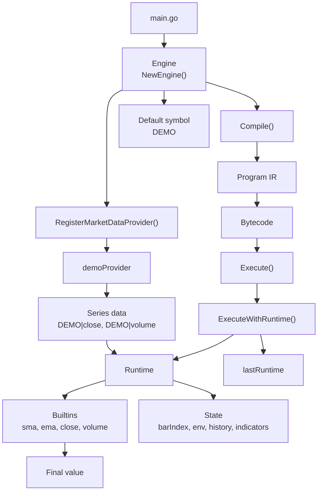
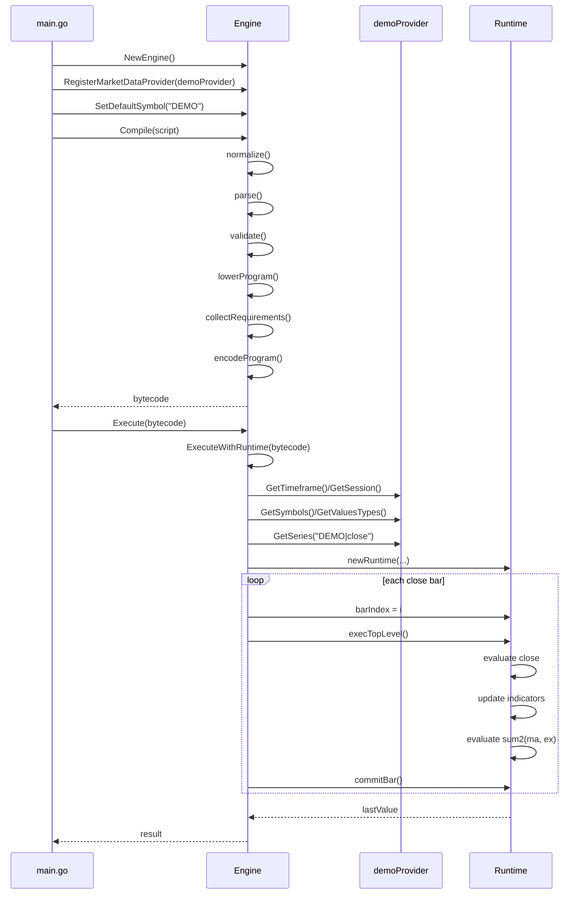

<!--
SPDX-FileCopyrightText: 2026 Woodstock K.K.

SPDX-License-Identifier: AGPL-3.0-only
-->

# Architecture and Design

This document describes the internal architecture and design concepts of Pinescription.

## Overview

Pinescription is a Pine Script v6 compiler and runtime. It takes Pine Script source, compiles it through several phases into bytecode, then executes that bytecode bar-by-bar against market data from registered providers.

## Engine vs Runtime

The distinction between Engine and Runtime is a key design concept in Pinescription.

| Aspect | Engine | Runtime |
|--------|--------|---------|
| Role | Long-lived coordinator for compilation and execution | Per-execution evaluation state holder |
| Lifetime | Reusable across multiple compile/execute calls | Created for a specific execution |
| Owns | Providers, registered functions, defaults, logs, bytecode cache, retained runtime | Loaded series, active symbol/value type, bar index, variable environments, history, indicator state, last value |
| Primary APIs | `Compile`, `Execute`, `ExecuteWithRuntime`, `RegisterMarketDataProvider`, `RegisterFunction` | `Snapshot`, `Series`, `SeriesKeys`, `Symbols`, `Value`, `ValueTypes`, `Release` |
| Responsibility | Resolve providers, derive execution context, construct runtime, drive bar-by-bar evaluation | Evaluate the program, maintain history, update indicators, expose execution state |
| Retention | Keeps the latest runtime via `Engine.Runtime()` | Can be released with `Runtime.Release()` |

Use `Engine` to configure and start execution. Use `Runtime` to inspect the state produced by a completed execution.

## Example Structure

The example consists of four principal components: the caller in `examples/basic/main.go`, an Engine instance, a demoProvider instance implementing Provider, and a Runtime instance created during execution. The engine owns provider registration, compilation state, execution coordination, and the retained runtime reference. The runtime owns per-execution evaluation state, including loaded series, indicator state, variable environments, and the final computed value.

## Compilation Flow

`Compile(script)` proceeds through these phases:

1. **Normalize** — Source compatibility syntax normalization
2. **Parse** — Parse into AST
3. **Validate** — Type constraint validation
4. **Lower** — Lower the AST (lowerProgram)
5. **Collect Requirements** — Derive series requirements from the program
6. **Encode** — Encode the resulting program as bytecode (`[]byte`)

## Execution Flow

`Execute(bytecode)` proceeds through these phases:

1. Resolve active symbol and required series through registered providers
2. Construct a Runtime instance
3. Evaluate the program once per bar (bar-by-bar loop)
4. Commit history state after each bar iteration
5. Return the final value produced on the last bar

## Streaming Evaluation Model

Pinescription uses a streaming evaluation model for indicators. Rather than recomputing the entire history on each bar, it maintains incremental state for indicators like SMA, EMA, and Bollinger Bands. This results in significant performance gains — benchmarks show 164x speedup for streaming Bollinger Bands (634 ns/op) vs full recomputation (103,926 ns/op).

## Provider Architecture

The Provider interface decouples the compiler/runtime from specific data sources. This allows:

- Multiple providers serving different symbols
- Symbol and value_type aggregation across providers
- Timeframe and session propagation from Engine to all providers
- Clean separation between compilation (pure) and execution (data-dependent)

## Examples

- `examples/basic/main.go` — Minimal end-to-end execution path
- `examples/volume_profile_pivot_anchored/` — Complex Pine v6 script with alerts
- `example_engine_test.go` — runnable pkg.go.dev examples for `NewEngine` and `ExecuteWithRuntime`
- `series/examples_test.go` — runnable pkg.go.dev examples for queue, mean, and crossover behavior
